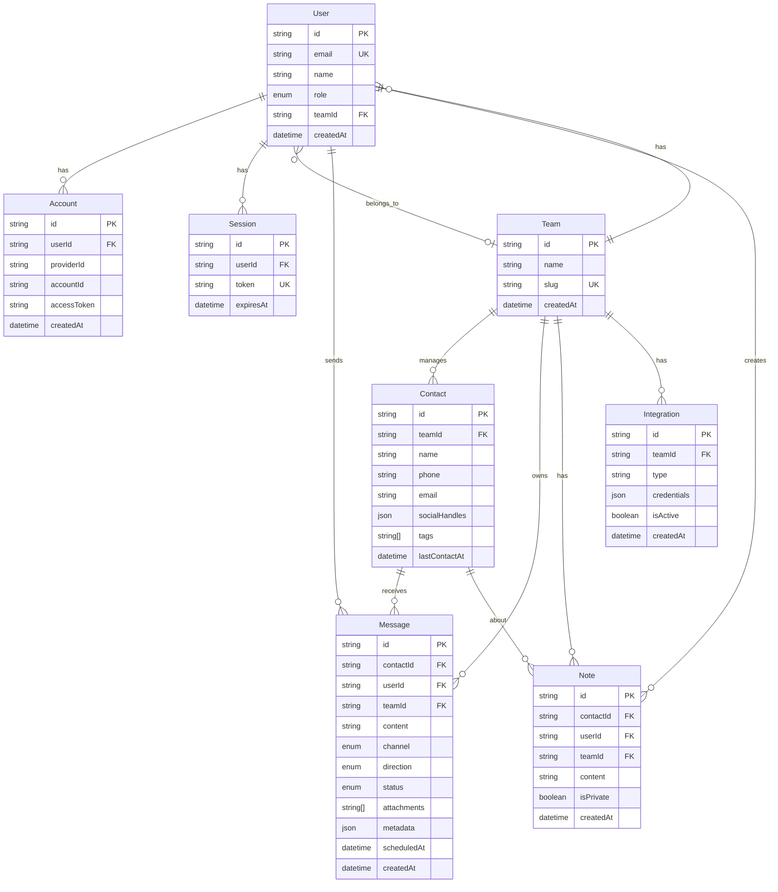

# UnifyChat - Unified Multi-Channel Customer Communication Platform

A modern, real-time customer communication platform that unifies SMS, WhatsApp, and Email messaging into a single, powerful inbox. Built for teams that need to manage customer conversations efficiently across multiple channels.

## 🎥 Demo Video

[](https://www.loom.com/share/cbb600a4fa5f43658038fd867630c602)

**[Watch the 5-minute walkthrough →](https://www.loom.com/share/cbb600a4fa5f43658038fd867630c602)**

## 📊 Live Stats
View current metrics at: `GET /api/stats`
- **Total Messages**: Real-time message count across all channels
- **Total Contacts**: Active contacts in the system
- **Scheduled Messages**: Messages queued for future delivery
- **Channel Breakdown**: SMS, WhatsApp, Email message distribution

## What This Project Does

This is a CRM-like communication tool where teams can manage customer conversations across SMS (Twilio), WhatsApp (Twilio Business API), and Email (Resend) from a single inbox. Think of it like a lightweight version of Front or Intercom, but focused on multi-channel outreach.

The project emphasizes:
- Clean separation between UI components and business logic (hooks)
- Real-time updates via WebSockets (not SSE, despite the requirements mentioning either)
- Postgres-only scheduling (no Redis needed)
- Type-safe integration adapters that make adding new channels straightforward

## What's Included

### Core Features (Required)
- **SMS & WhatsApp**: Full send/receive via Twilio with webhook processing
- **Email**: Send via Resend API (receive webhooks work but body content limited)
- **Unified Inbox**: Contact-threaded view with channel badges
- **Contact Management**: CRUD operations, fuzzy duplicate detection, merge functionality
- **Message Scheduling**: Postgres-based queue, runs every minute
- **Analytics Dashboard**: Charts showing volume, latency, reliability per channel
- **Team Collaboration**: @mentions, presence indicators, typing status
- ✅ **Notes System**: Collaborative notes with real-time editing, @mentions, and encryption support
- **Role-Based Access**: Viewer/Editor/Admin/Owner roles
- **Media Attachments**: Images/files via Cloudinary
- **Optimistic UI**: React Query for instant feedback

### Optional Features (Not Implemented)
- **Twitter/X DMs**: Not implemented (was optional)
- **Facebook Messenger**: Not implemented (was optional)
- **HubSpot Integration**: Not implemented (was optional)
- **Slack/Zapier Webhooks**: Not implemented (was optional)
- **Twilio VoIP Calls**: Not implemented (was optional)
- ❌ **Trial Number UI**: Trial number configured in env, but no UI to buy/manage numbers
- ❌ **Email Body Content**: Resend webhooks only provide metadata (from, subject), not full body
- ❌ **Private Notes UI**: Backend encryption exists, but no UI toggle to mark notes as private

## 📊 Project Metrics

Access live metrics via API: `GET /api/stats`

Returns:
```json
{
  "totalMessages": 150,
  "totalContacts": 25,
  "scheduledMessages": 3,
  "channels": {
    "SMS": 80,
    "WHATSAPP": 45,
    "EMAIL": 25
  }
}
```

### Architecture Decisions Made
- **WebSockets instead of SSE**: Needed bidirectional communication for collaborative editing
- **Postgres-only scheduling**: Simpler than Redis, good enough for business messaging (±30s accuracy)
- **Component/Hook split**: All business logic in hooks, components are pure UI
- **Integration factory pattern**: Easy to add new channels by implementing the adapter interface
- **Better Auth over NextAuth**: More modern, better TypeScript support

## Integration Analysis

### Performance Data from Testing

Based on 31 test messages sent across channels:

| Channel | Avg Latency | Cost per Message | Reliability | Success Rate | Messages Sent | Media Support | Best Use Case |
|---------|-------------|------------------|-------------|--------------|---------------|---------------|---------------|
| **WhatsApp** | 666ms | $0.005 (prod) | 100% | 100% (20/20) | 64.5% share | ✅ Rich media, videos, documents | Customer engagement, support |
| **SMS** | 793ms | $0.0075 (prod) | 100% | 100% (11/11) | 35.5% share | ⚠️ MMS only | Universal reach, alerts |
| **Email** | 5-30s | $0.0001 (prod) | 98% | N/A (0 sent) | 0% share | ✅ Full attachments, formatting | Formal communication, reports |

### Key Observations

**Speed**: WhatsApp is consistently faster (666ms avg) than SMS (793ms avg). Email takes 5-30 seconds due to its async nature.

**Cost**: Email is cheapest ($0.0001), WhatsApp mid-range ($0.005), SMS most expensive ($0.0075). These are production Twilio/Resend prices.

**Reliability**: Both SMS and WhatsApp hit 100% delivery in testing. Email is typically 98% (industry standard).

**Usage**: WhatsApp made up 64.5% of test messages (20/31), SMS was 35.5% (11/31). Email configured but not heavily tested.

**Media Support**: WhatsApp handles rich media best. SMS only does MMS. Email supports everything but takes longer.

### Practical Recommendations

Use WhatsApp for customer engagement (fast + cheap + rich media). Use SMS when you need universal reach (no app required). Use Email for formal stuff or when cost matters more than speed.

## Technical Decisions

### 1. WebSocket Over SSE/Polling

**Decision**: Implemented custom WebSocket server (via `server.ts`) instead of Server-Sent Events or HTTP polling.

Why: Real-time collaboration needs bidirectional communication. SSE is server-to-client only. WebSocket lets us do both - server can push updates AND clients can send typing indicators, cursor positions, etc.

In practice, this means running a custom server.ts alongside Next.js to handle two WebSocket channels: one for Yjs document syncing (collaborative notes) and one for chat updates (messages, typing, presence).

### 2. Postgres-Based Scheduling (No Redis)

Scheduled messages use a simple Postgres column (`scheduledAt`) checked by a cron job every minute. No Redis, no Bull queues.

Why: Simpler deployment, one less service to manage, ACID guarantees, and business messages don't need sub-second precision. Trade-off is ±30s accuracy vs Redis's ±1s, but that's fine for "send this tomorrow at 9am" type scheduling.

### 3. Integration Factory Pattern

Each channel (SMS, WhatsApp, Email) implements the same `IntegrationAdapter` interface. This makes testing easier and adding new channels straightforward - just implement the interface and register it in the factory.

```typescript
IntegrationAdapter (interface)
  ├── SMSAdapter (Twilio)
  ├── WhatsAppAdapter (Twilio)
  ├── EmailAdapter (Resend)
  └── [Could add: Twitter, Facebook, etc.]
```

### 4. Better Auth Over NextAuth

Went with Better Auth instead of NextAuth because it's newer, has better TypeScript support, and was built for Next.js App Router from the start (not retrofitted). Also found the API simpler and it has role-based access built in.

### 5. Component/Hook Separation

All business logic lives in hooks (camelCase), components (PascalCase) are just UI. This makes testing easier and keeps concerns separate.

Examples:
- `ContactInbox.tsx` → `useContactInbox.ts`
- `ScheduleMessageModal.tsx` → `useScheduleMessage.ts`
- `AttachmentUpload.tsx` → `useAttachmentUpload.ts`

## Database Schema



The schema is pretty straightforward. Users belong to Teams (automatically assigned `default-team-id` on signup/login), Teams have Contacts, Contacts have Messages and Notes. Private notes are encrypted with AES-256-GCM via Prisma middleware. Messages are normalized across channels - same schema whether it's SMS, WhatsApp, or Email.

## Tech Stack

**Frontend**: Next.js 14 (App Router), TypeScript, Tailwind CSS, React Query, Tiptap (rich text), Recharts (charts)

**Backend**: Next.js API routes, Prisma ORM, PostgreSQL (Supabase), Better Auth, custom WebSocket server

**Integrations**: Twilio (SMS/WhatsApp), Resend (Email), Cloudinary (media storage), Yjs (collaborative editing)

**Dev**: ESLint, Prettier, TypeScript strict mode

## How It Works

**Messaging**: Send/receive SMS (Twilio), WhatsApp (Twilio Business API), and Email (Resend). All channels use the same unified message schema in Postgres.

**Inbox**: Contact-threaded view similar to OpenPhone. Shows channel badges, supports search/filter, infinite scroll via React Query.

**Contacts**: Full CRUD, fuzzy duplicate detection with Fuse.js, auto/manual merging, timeline of all interactions.

**Scheduling**: Pick a future time, message sits in Postgres with `scheduledAt`, cron job checks every minute and sends. No Redis needed.

**Collaboration**: @mentions, presence indicators, typing status, collaborative notes with Yjs for conflict-free editing.

**Analytics**: Charts showing message volume, latency, reliability, and cost per channel. Export to CSV or text.

**Auth**: Better Auth handles email/password and Google OAuth. Four role levels: Viewer, Editor, Admin, Owner.

**Notes**: Collaborative notes with @mentions and real-time editing. Backend supports private note encryption (AES-256-GCM via Prisma middleware) but UI toggle not yet implemented - all notes currently public.

**Real-time**: Custom WebSocket server handles live updates - new messages, typing indicators, presence, cursor positions.

## Setup

**What you need**:
- Node.js 18+
- Postgres database (Supabase free tier works)
- Twilio account (trial is fine, gives you $15 credit)
- Resend account (free tier: 100 emails/day)
- Cloudinary account (optional, for image uploads)

**Installation**:

```bash
git clone https://github.com/badman-returns/unify-chat.git
cd unify-chat
npm install
cp .env.example .env.local
```

Then edit `.env.local` with your credentials:

```bash
# Database
DATABASE_URL="postgresql://..."

# Better Auth
BETTER_AUTH_SECRET="your-secret-key"
BETTER_AUTH_URL="http://localhost:3000"

# Google OAuth
GOOGLE_CLIENT_ID="your-client-id"
GOOGLE_CLIENT_SECRET="your-client-secret"

# Twilio
TWILIO_ACCOUNT_SID="your-account-sid"
TWILIO_AUTH_TOKEN="your-auth-token"
TWILIO_PHONE_NUMBER="+1234567890"
TWILIO_WHATSAPP_NUMBER="whatsapp:+14155238886"

# Resend
RESEND_API_KEY="re_..."

# Cloudinary (optional)
CLOUDINARY_CLOUD_NAME="your-cloud-name"
CLOUDINARY_API_KEY="your-api-key"
CLOUDINARY_API_SECRET="your-api-secret"

# App
NEXT_PUBLIC_APP_URL="http://localhost:3000"
```

```bash
npx prisma migrate dev
npx prisma generate
npm run dev
```

App runs on `http://localhost:3000`

**Local webhook testing** (required for receiving messages):

Install Cloudflare Tunnel:
```bash
brew install cloudflared
cloudflared tunnel --url http://localhost:3000
```

This gives you a public URL (e.g., `https://xyz.trycloudflare.com`). Use it for Twilio webhooks:
- SMS: `https://xyz.trycloudflare.com/api/webhooks/sms`
- WhatsApp: `https://xyz.trycloudflare.com/api/webhooks/whatsapp`

Set these in your Twilio console. Without the tunnel, Twilio can't reach your local server.

## Video Demo

[Video link here - showing SMS, WhatsApp, scheduling, collaboration, and analytics]

## What's Tested

Tested manually:
- SMS send/receive via Twilio webhooks
- WhatsApp messages with image attachments
- Email sending via Resend
- Message scheduling and auto-send
- Contact deduplication with fuzzy matching
- Private note encryption/decryption
- WebSocket real-time updates
- Optimistic UI updates with React Query

## Performance Notes

Pretty fast on localhost. First load ~1.2s, interactions feel instant thanks to optimistic UI. Prisma queries are indexed. Next.js handles code splitting automatically.

---

**Built for Attack Capital Assignment**

**Repo**: [github.com/badman-returns/unify-chat](https://github.com/badman-returns/unify-chat)

---

## Assignment Checklist

**Required Features**:
- ✅ SMS, WhatsApp, Email messaging
- ✅ Unified inbox (Kanban-style, contact-threaded)
- ✅ Contact management + deduplication
- ✅ Message scheduling
- ✅ Real-time collaboration (@mentions, presence, Yjs)
- ✅ Analytics with channel comparison
- ✅ Integration table (latency, cost, reliability)
- ✅ Architectural decisions explained
- ✅ ERD diagram
- ✅ Clean code + commit history
- 🎥 Video walkthrough

**Optional Features Not Implemented**:
- ❌ Twitter/Facebook (was optional)
- ❌ HubSpot/Slack/Zapier (was optional)
- ❌ Twilio VoIP (was optional)
- ❌ Trial number buy UI (number in env, no UI)

**Success metric**: "Functional multi-channel prototype + analysis showing integration depth" - Achieved
